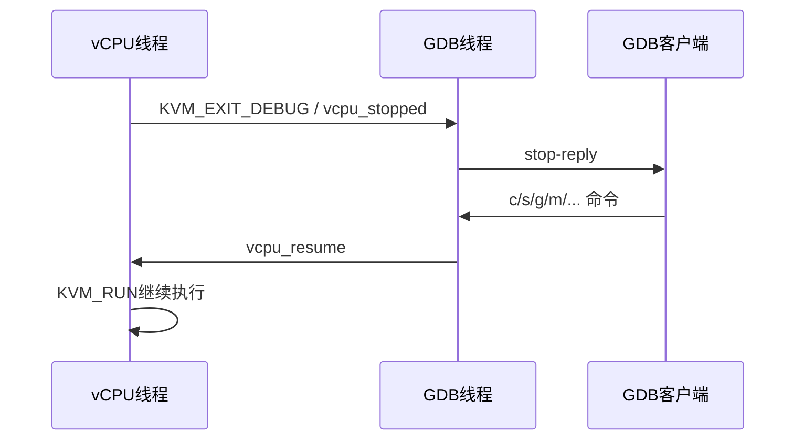

# kvmtool GDB Stub 架构文档（中文）

## 1. 背景与目标

为满足内核与虚拟机场景调试需求，kvmtool 引入 GDB Remote Serial Protocol (RSP) Stub，
提供与 QEMU 类似的远程调试能力（`target remote`）。

本方案目标：

1. 支持 x86 与 arm64 的 GDB 远程调试
2. 支持断点、单步、寄存器访问、内存访问
3. 在内核场景下尽量降低中断对单步路径的干扰

---

## 2. 总体架构

```
┌──────────────────────────────────────────────────────────────┐
│  Host                                                        │
│                                                              │
│  ┌─────────┐  GDB RSP over TCP   ┌────────────────────────┐ │
│  │  GDB    │ ◄──────────────────► │  kvmtool GDB stub      │ │
│  │(client) │  localhost:PORT     │  (gdb.c / x86/gdb.c)   │ │
│  └─────────┘                     └──────────┬─────────────┘ │
│                                             │ KVM ioctls    │
│                                  ┌──────────▼─────────────┐ │
│                                  │  KVM vCPU threads      │ │
│                                  │  KVM_EXIT_DEBUG        │ │
│                                  │  KVM_SET_GUEST_DEBUG   │ │
│                                  └──────────┬─────────────┘ │
│                                             │               │
│  ┌──────────────────────────────────────────▼─────────────┐ │
│  │  Guest VM (Linux kernel)                               │ │
│  └────────────────────────────────────────────────────────┘ │
└──────────────────────────────────────────────────────────────┘
```

### 2.1 通用层（`gdb.c`）

职责：

- RSP 报文收发与分发
- stop-reply 组织
- 软件断点/硬件断点表管理
- vCPU 线程与 GDB 线程同步
- guest 虚拟地址访问与受控回退

### 2.2 架构层（`x86/gdb.c`、`arm/aarch64/gdb.c`）

职责：

- GDB 寄存器布局与 KVM 寄存器映射
- 架构断点寄存器配置
- 调试退出类型判定
- 单步前后架构状态修正（x86 `RFLAGS`、arm64 `PSTATE/DAIF`）

---

## 3. 线程模型与同步

### 3.1 停机/恢复时序图（Mermaid）



系统内存在两类关键线程：

1. vCPU 线程：执行 `KVM_RUN`，命中 `KVM_EXIT_DEBUG` 后进入 `kvm_gdb__handle_debug()`
2. GDB 线程：维护 TCP 连接，处理 RSP 命令并决定 resume 策略

同步机制：

- `stopped_vcpu`：记录当前调试停机点所属 vCPU
- `vcpu_stopped` 条件变量：vCPU 通知 GDB 线程“已停机”
- `vcpu_resume` 条件变量：GDB 线程通知 vCPU“继续执行”

---

## 4. 方案落地

### 4.1 x86 方案

- 新增 x86 架构实现：`x86/gdb.c`
- Makefile 接入 x86 架构编译路径
- 支持：
  - 寄存器读写
  - 软件断点与硬件断点
  - 单步调试

单步稳定性策略（x86）：

- 恢复执行前修正 `TF/RF`
- 单步窗口按需处理 IF，降低中断路径抢占

### 4.2 arm64 方案

- 新增 arm64 架构实现：`arm/aarch64/gdb.c`
- Makefile 接入 arm64 架构编译路径
- 本提交补全 arm64 架构与单步路径，和 x86 共用同一套通用协议层
- 支持：
  - 基础寄存器集映射
  - 断点/观察点编程
  - 单步调试

单步稳定性策略（arm64）：

- 单步窗口保存并临时调整 DAIF（A/I/F）
- stop 后恢复原始中断屏蔽状态

### 4.3 通用增强

- 软件断点生命周期管理（含 step-over）
- 二进制内存写（`X` 包）转义处理
- `make check` 测试路径环境自适配（boot kernel 可读性判断）

---

## 5. 单步执行时序（抽象）

```text
命中断点
 -> 进入 GDB 会话
 -> 若为软件断点：恢复原指令
 -> 设置单步运行状态（架构相关）
 -> 执行一步
 -> 停机后恢复架构临时状态
 -> 如需继续：重插断点并 resume
```

---

## 6. 关键设计取舍

1. **优先稳定性**：不宣称不完整的扩展能力，避免触发 GDB 状态机错配
2. **架构隔离**：通用层负责协议，架构层负责寄存器与异常语义
3. **渐进增强**：先保证 x86/arm64 可用，再优化单步体验

---

## 7. 适用边界

- 内核态调试存在中断/调度噪声，单步行为不保证绝对源码线性
- 推荐单核调试（`-c 1`）以降低并发干扰
