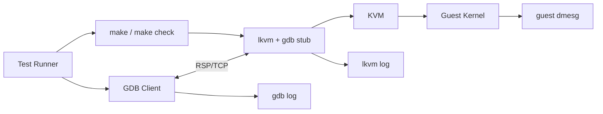
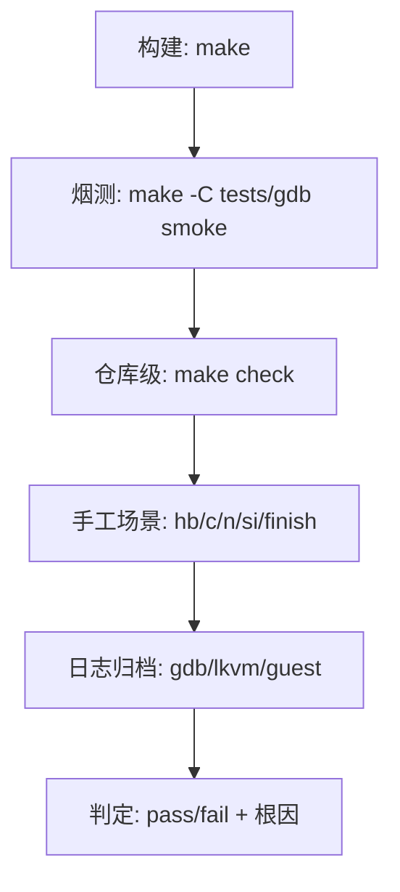

# kvmtool GDB Stub 测试方案（中文）

## 1. 测试目标

验证 GDB Stub 在 x86 与 arm64 上的功能正确性与单步可用性，重点覆盖：

1. 基础连接与寄存器访问
2. 断点命中与恢复
3. 单步/finish 稳定性
4. 内存访问与字符串读取正确性
5. 回归执行链（`make check`）在不同环境下行为一致

---

## 2. 测试架构

### 2.0 图形化测试拓扑（Mermaid）



```text
Host
 ├─ GDB Client
 ├─ lkvm (gdb stub)
 ├─ KVM
 └─ Guest Linux
```

数据路径：

- GDB ↔ lkvm：RSP over TCP
- lkvm ↔ KVM：ioctl
- KVM ↔ Guest：vmexit / resume

---

## 3. 测试环境

### 3.1 基础要求

- 可访问 `/dev/kvm`
- 工具链可完成 `make`
- boot 测试可用 `mkisofs` 或 `xorrisofs`

### 3.2 推荐参数

- guest 参数含 `nokaslr`
- 调试优先单核：`-c 1`

### 3.3 `make check` 自适配说明

- 若存在可读 `/boot/vmlinuz*`：执行 boot runtime
- 若不存在：打印 skip，不作为失败
- 可通过 `BOOT_TEST_KERNEL=/path/to/vmlinuz` 强制指定

---

## 4. 测试场景与步骤

### 4.0 测试执行流程图（Mermaid）



## 4.1 构建层测试

命令：

```bash
make
```

结果判定：

- 编译通过，无新增错误

## 4.2 自动化烟测（x86）

命令：

```bash
make -C tests/gdb smoke
```

覆盖内容：

- `qSupported`
- `qXfer:features:read`
- `g` 寄存器读取
- `Z0/z0` 断点命令路径
- `X` 写内存与 `m` 读回

结果判定：

- 输出 `PASS: x86 GDB stub smoke test`

## 4.3 仓库级测试

命令：

```bash
make check
```

结果判定：

- PIT 测试通过
- boot 测试成功或合理 `SKIP`

## 4.4 手工调试场景（x86/arm64）

启动：

```bash
./lkvm run --gdb 1234 --gdb-wait -c 1 ...
```

GDB 操作：

```gdb
target remote :1234
hb do_sys_openat2
c
n
si
finish
```

结果判定：

- 可稳定命中断点
- `n/si/finish` 可推进
- 不应出现 GDB 内部断言崩溃

---

## 5. 结果解读方法

## 5.1 若出现 `finish_step_over ... trap_expected`

关注：

- 软件断点生命周期与 step-over 状态切换是否一致
- stop/reply 与 GDB 预期是否错配

## 5.2 若 x86 单步频繁跳入 APIC 中断

关注：

- 是否使用单核
- 单步窗口中断控制逻辑是否生效

## 5.3 若 arm64 单步频繁落入 `entry.S`

关注：

- `DAIF` 临时处理与恢复路径
- 是否处于高频中断/调度噪声区

## 5.4 若参数读取出现乱码

关注：

- GVA->GPA 失败回退阈值是否过宽
- 不可翻译地址是否被误当作物理地址读取

---

## 6. 测试记录模板

每轮建议记录：

1. 测试平台（x86/arm64）
2. 启动命令
3. GDB 版本
4. 场景步骤
5. 关键日志（GDB/lkvm/guest）
6. 结果（通过/失败）
7. 失败原因与处理结论
